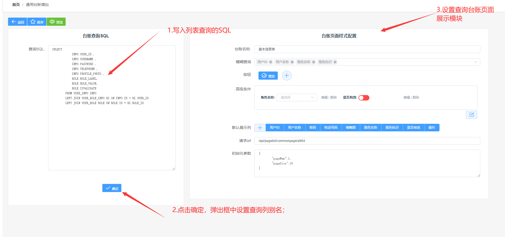
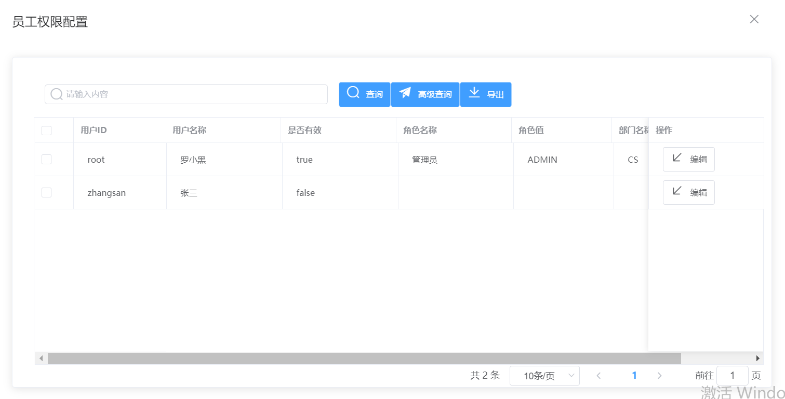

# cs_vue

## 基础指令
```
下载依赖
npm install
运行项目
npm run serve
项目打包
npm run build

```
## 基础功能实现
```
vue.config.js 配置转发路径和端口，基础路径配置等；
.env文件配置环境的相关映射

```
###  1.通用台账配置页面

作用：1.通过前端配置可以生成一个简单的列表页面；2.简化通用列表页面的新增；3.通用报表页面，通用功能导出。



**配置生成的页面的样式**




###  2.通用权限管理页面


###  3.BPMN 流程配置页面


备注：
涉及到的业务官网：
- 图形拖动组件 （https://sortablejs.github.io/Vue.Draggable/#/simple）
- 树状选择框   https://vue-treeselect.js.org/
- **整合BPMN** 
   - 借鉴代码：https://gitee.com/xiaofanger/vue-bpmn-flowable
   - 借鉴博客（很详细的讲解了所有的操作）：https://www.jianshu.com/p/1d6e4ae5d2c1
- UI框架（ElementUI） https://element.eleme.io/#/zh-CN/guide/design
